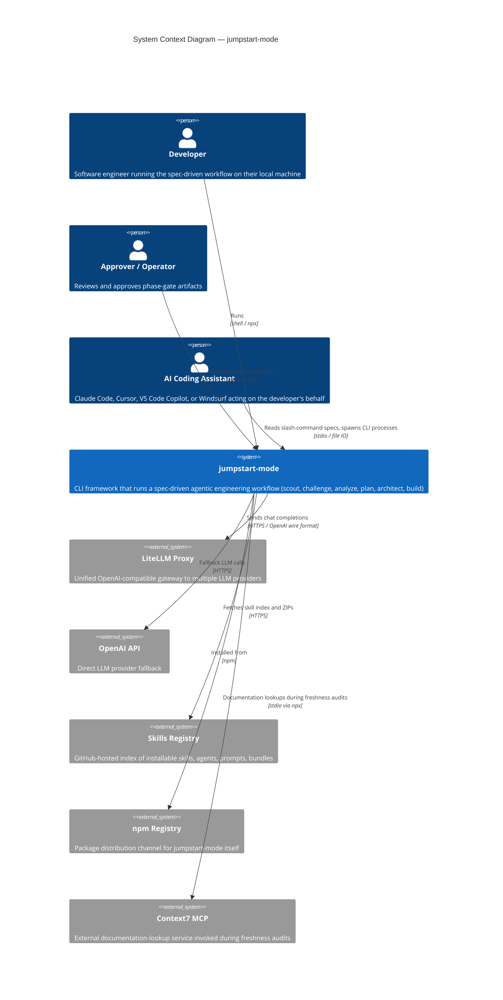
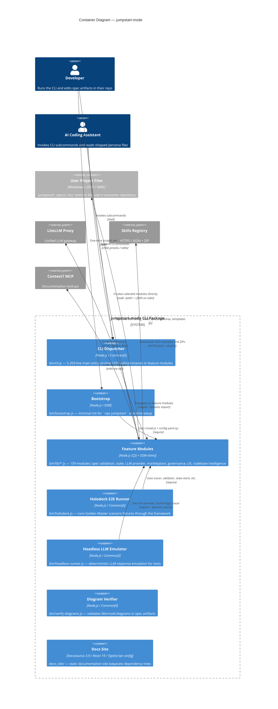

# Codebase Context

> **Phase:** Pre-0 -- Reconnaissance
> **Agent:** The Scout
> **Status:** Approved
> **Created:** 2026-04-24
> **Approval date:** 2026-04-24
> **Approved by:** Samuel

---

## Project Overview

| Attribute | Detail |
|-----------|--------|
| **Project Name** | `jumpstart-mode` (npm package name); repository: `JumpStart-AutoNav` |
| **Primary Language(s)** | JavaScript (CommonJS + ESM mixed); TypeScript present only in `docs_site/` |
| **Framework(s)** | No application framework. Plain Node.js. Docusaurus 3.9 in `docs_site/` |
| **Build System** | npm scripts only. No bundler (`tsc`, `webpack`, `esbuild`, `rollup`, `tsup`) — source runs directly via `node` |
| **Package Manager(s)** | npm (single workspace; `docs_site/` has its own `package.json` + `package-lock.json`) |
| **Runtime** | Node.js — `"engines": { "node": ">=14.0.0" }` declared; development machine observed running Node 25.9.0 |
| **Repository Age** | First commit 2026-02-10; latest 2026-04-24 (~2.5 months); 21 commits on `main` |
| **Approximate Size** | ~70,000 lines of JavaScript across `bin/`, `tests/`, `docs_site/src/`; `bin/` contains 165 files; `tests/` contains 134 files |
| **Published Version** | 1.1.14 (bumped 2026-04-24 in this session); previously 1.1.13 |

---

## Repository Structure

> **Note:** This structure reflects the *original* codebase only. Files and directories created or managed by the JumpStart installation process itself (`.jumpstart/`, `specs/`, `AGENTS.md`, `CLAUDE.md`, `.cursorrules`, and Copilot integration files under `.github/copilot-instructions.md`, `.github/agents/`, `.github/prompts/`, `.github/instructions/`) are excluded per `agents.scout.exclude_jumpstart_paths`. Pre-existing `.github/workflows/` and `.github/hooks/` content is included.

```
JumpStart-AutoNav/
├── bin/                               # CLI + library source (all runtime JS lives here)
│   ├── cli.js                         # Main CLI dispatcher — 5,359 lines, CJS, 120+ subcommand branches
│   ├── bootstrap.js                   # Alternative init entry (`npx jumpstart` → here); ESM
│   ├── headless-runner.js             # Headless LLM emulation harness for deterministic testing (808 lines)
│   ├── holodeck.js                    # E2E scenario runner for Golden Master tests (512 lines)
│   ├── verify-diagrams.js             # Mermaid diagram validator (stand-alone utility)
│   ├── context7-setup.js              # Installs Context7 MCP into various IDE configs
│   └── lib/                           # 159 feature modules (~37K LOC); mix of CJS, ESM-with-shim, and one `.cjs`
├── tests/                             # 84 `*.test.js` files (unit/integration/regression) + e2e scenarios
│   ├── adversarial-review-tests/      # 1 test file
│   ├── e2e/                           # 37 files — holodeck scenarios, fixtures, personas, reports
│   │   ├── scenarios/baseline/        # Minimal scenario (challenger phase only)
│   │   └── scenarios/ecommerce/       # Full 5-phase scenario (challenger → developer)
│   ├── fixtures/                      # 6 files — shared test input data
│   └── golden-masters/                # 3 files — canonical expected outputs for regression tests
├── docs/                              # 4 Markdown files — user-facing guides (onboarding, quickstart, agent-access-reference, how-jumpstart-works)
├── docs_site/                         # Docusaurus 3.9 site; TypeScript config; React 19; Tailwind CSS; 51 files
│   ├── docusaurus.config.ts           # Site configuration
│   ├── blog/ · docs/ · src/           # Content, custom components, plugins
│   ├── scripts/sync-agent-data.js     # Utility to sync agent persona data into the site
│   ├── tsconfig.json                  # Extends @docusaurus/tsconfig (dev-only; not compiled into runtime)
│   └── package.json                   # Separate dependency tree
├── src/                               # Reserved but effectively empty (contains only `.gitkeep`)
├── .github/                           # Mixed: pre-existing workflows/hooks + JumpStart-installed copilot files (excluded)
│   ├── workflows/
│   │   └── quality.yml                # "Spec Quality Gate" CI workflow (Node 20; GitHub Actions)
│   └── hooks/                         # AutoNav VS Code Copilot hook definitions (27 JSON files)
├── .vscode/                           # Editor configuration (tasks.json); MCP config excluded from scout
├── .env.example                       # Template for local env (LITELLM_BASE_URL, LITELLM_API_KEY, OPENAI_API_KEY)
├── .gitignore                         # Excludes node_modules, .env, *.tgz, e2e/.tmp, reports, etc.
├── .npmignore                         # Controls npm publish tarball contents
├── .windsurfrules                     # Windsurf IDE integration rules (parallel to .cursorrules)
├── install.sh                         # Bash installer (17 KB) — alternative to `npx jumpstart-mode`
├── LICENSE                            # MIT
├── README.md                          # 51 KB user-facing README
├── package.json                       # npm manifest; bin entries; scripts
├── package-lock.json                  # npm lockfile
├── vitest.config.js                   # Test runner config (vitest + v8 coverage provider)
└── jumpstart-mode-1.1.14.tgz          # Pack artifact (present in working tree; ignored by git via `*.tgz`)
```

### Directory Purposes

| Directory | Purpose | Language(s) | Notable Files |
|-----------|---------|-------------|---------------|
| `bin/` | CLI entry points and utility runners | JavaScript | `cli.js` (5,359 lines); `bootstrap.js` (ESM); `headless-runner.js`; `holodeck.js` |
| `bin/lib/` | 159 feature modules — spec validation, LLM provider, state store, marketplace installer, governance/enterprise modules, UX/workflow modules, codebase intelligence, testing infrastructure | JavaScript | `config-yaml.cjs`; `state-store.js`; `validator.js`; `install.js`; `llm-provider.js`; `simulation-tracer.js` |
| `tests/` | Vitest unit + integration + regression + e2e tests | JavaScript | `test-*.test.js` flat at top level; `e2e/` subdir for scenarios; `golden-masters/` for regression fixtures |
| `tests/e2e/scenarios/` | Holodeck end-to-end fixtures simulating a full phased project | Markdown (specs), JSON (configs) | `baseline/` (1 phase), `ecommerce/` (5 phases) |
| `docs/` | Hand-written user-facing guides | Markdown | `onboarding.md` (40 KB), `how-jumpstart-works.md` (23 KB), `quickstart.md`, `agent-access-reference.md` |
| `docs_site/` | Static documentation site (Docusaurus) | TypeScript (config), JavaScript (plugins), MDX (content), CSS (Tailwind) | `docusaurus.config.ts`; `scripts/sync-agent-data.js` |
| `src/` | Reserved for user-project source code; empty in this repository | — | `.gitkeep` only |
| `.github/workflows/` | Pre-existing CI configuration | YAML | `quality.yml` — runs on PR/push when `specs/`/`tests/`/`.jumpstart/` change |
| `.github/hooks/` | AutoNav VS Code Copilot hook definitions (pre-existing) | JSON | `autonav.json` and per-agent hook files |

---

## Technology Stack

| Category | Technology | Version | Role | Notes |
|----------|-----------|---------|------|-------|
| **Language** | JavaScript | ES2020+ | Primary application language | Mixed CJS + ESM |
| **Language** | TypeScript | via `@docusaurus/tsconfig` | Dev-only (docs_site config) | Not used in runtime code |
| **Runtime** | Node.js | engines `>=14.0.0` declared | Runtime | Observed dev machine: 25.9.0; `yaml@2` implicitly requires newer Node |
| **Framework** | (none) | — | No HTTP framework; plain Node | CLI-only package |
| **Site framework** | Docusaurus | 3.9.2 | `docs_site/` only | Separate dependency tree |
| **UI (site)** | React + Tailwind | React 19, Tailwind (via `tailwind.config.js`) | `docs_site/` only | Not in runtime |
| **Database** | (none) | — | File-system state (`.jumpstart/state/*.json`) | No database connection anywhere |
| **Testing** | vitest | `^3.2.4` (installed 3.2.4) | Test runner | v8 coverage provider configured |
| **Linting** | (none configured) | — | No ESLint, Prettier, Biome, JSHint | No lint scripts in package.json |
| **CI/CD** | GitHub Actions | — | `.github/workflows/quality.yml` | Triggers on PR/push when specs/tests/.jumpstart change |
| **Containerization** | (none) | — | No Dockerfile, no docker-compose | CLI distributed via npm |
| **Package manager** | npm | — | `package.json` + `package-lock.json` | Separate lockfile in `docs_site/` |
| **Installation path** | npm / bash | — | `npx jumpstart-mode`, `npx jumpstart`, or `./install.sh` | Three installation entry points |

---

## Dependencies

### Production Dependencies (from `/package.json`)

| Package | Version | Category | Role |
|---------|---------|----------|------|
| `chalk` | `^4.1.2` | UI / Utility | Terminal color output. Version 4 is the last CJS release; v5+ is ESM-only |
| `dotenv` | `^17.3.1` | Configuration | Loads `.env` file into `process.env` |
| `openai` | `^6.23.0` | LLM / Integration | OpenAI Node SDK — used as client for LiteLLM proxy (multi-provider routing) |
| `prompts` | `^2.4.2` | UI / Utility | Interactive CLI prompts |
| `yaml` | `^2.8.1` | Parsing | YAML parse/stringify — AST-preserving via `Document` API |

### Development Dependencies

| Package | Version | Category | Role |
|---------|---------|----------|------|
| `vitest` | `^3.2.4` | Testing | Test runner; also provides `v8` coverage provider used in `vitest.config.js` |

### docs_site Dependencies (separate tree; `/docs_site/package.json`)

| Package | Version | Category |
|---------|---------|----------|
| `@docusaurus/core`, `@docusaurus/preset-classic` | `3.9.2` | Site framework |
| `@docusaurus/module-type-aliases`, `@docusaurus/tsconfig`, `@docusaurus/types` | `3.9.2` | Site dev tooling (TypeScript config) |
| `@mdx-js/react` | `^3.0.0` | Content rendering |
| `react`, `react-dom` | `^19.0.0` | UI |
| `clsx`, `prism-react-renderer` | — | UI utilities |

### Dependency Observations

- Production dep count is unusually small (5 packages) for a framework of this scope.
- `chalk@4` is intentionally pinned to the last CJS release; upgrading to chalk@5 requires ESM migration.
- `openai@6` is used as a proxy-compatible client (see `.env.example` → `LITELLM_BASE_URL`) rather than as a direct OpenAI client.
- No runtime dependency on a framework, HTTP server, database driver, or ORM.
- `npm audit` reports 3 known vulnerabilities at the time of reconnaissance: `yaml` (moderate, stack overflow on deeply nested input), `picomatch` (high, POSIX character-class method injection), `vite` (high, path traversal). The latter two are transitive via `vitest`.
- `docs_site/` has its own dependency tree (React 19, Docusaurus 3.9); its `package-lock.json` is separate.

---

## External Integrations

| System / Service | Type | Protocol | Purpose | Configuration |
|------------------|------|----------|---------|---------------|
| **LiteLLM proxy** | LLM gateway | HTTPS / OpenAI-compatible | Unified access to OpenAI / Anthropic / Gemini via the `openai` SDK with `baseURL` override | `LITELLM_BASE_URL` (default `http://localhost:4000`), `LITELLM_API_KEY` |
| **OpenAI API (direct)** | LLM | HTTPS | Fallback / direct usage | `OPENAI_API_KEY` |
| **JumpStart Skills Registry** | HTTP endpoint | HTTPS | Fetches skill/agent/prompt metadata + ZIP downloads for the marketplace installer | `https://raw.githubusercontent.com/CGSOG-JumpStarts/JumpStart-Skills/main/registry/index.json` |
| **Context7 MCP** | MCP server | stdio (via `npx`) | Live documentation lookups during freshness-audit checks | `npx -y @upstash/context7-mcp …` invoked by `bin/context7-setup.js` |
| **npm registry** | Package registry | HTTPS | Package consumers install via `npx jumpstart-mode` | No configuration beyond default `npm` |

---

## Reference Implementations (Golden Paths)

### Core Implementation Patterns

| Pattern | Reference File Path | Description |
|---------|---------------------|-------------|
| CLI subcommand dispatch | `bin/cli.js` (lines ~140–5300) | Monolithic `async main()` with 120+ `subcommand === '…'` branches; each branch either `require`s or dynamically `import`s the relevant lib module |
| JSON-stdin microservice | `bin/lib/config-loader.js` | Module is invokable as `node bin/lib/config-loader.js` with a JSON payload on stdin; writes JSON to stdout. Several lib modules follow this dual-use pattern |
| YAML config round-trip | `bin/lib/config-yaml.cjs` | Uses `yaml` package's `Document` AST (`doc.setIn`/`doc.toString`) to preserve comments and formatting |
| Feature module (synchronous) | `bin/lib/hashing.js` | Pure synchronous function module — `const fs = require('fs')`, `module.exports = { hashFile, hashContent, ... }` |
| Feature module (ESM-shim) | `bin/lib/install.js` | Uses `import { createRequire } from 'module'` + `createRequire(import.meta.url)` to pull in CJS deps inside an otherwise-ESM module |
| State file writer | `bin/lib/state-store.js` | Reads/writes `.jumpstart/state/state.json`; includes mutable module-level hook for timeline forwarding |
| LLM tool-call loop | `bin/lib/llm-provider.js` | Returns a duck-typed provider object with mock vs live branches; live uses `openai` SDK with `baseURL` override |

### Testing Conventions

| Pattern | Reference Test File Path | Description |
|---------|--------------------------|-------------|
| Unit test (pure module) | `tests/test-schema.test.js` | `createRequire`-based import of a lib module; `describe`/`it` style; no tempdir |
| Integration test (tempdir) | `tests/test-bootstrap-conflicts.test.js` | `fs.mkdtempSync` → manipulate files → invoke module → assert file tree |
| Regression / Golden Master | `tests/test-regression.test.js` | Structural diff against `tests/golden-masters/expected/` |
| Deterministic artifact | `tests/test-deterministic-artifacts.test.js` | Byte-stable hash verification after repeated runs |
| Handoff contract | `tests/test-handoffs.test.js` | Validates JSON payload against `.jumpstart/handoffs/*.schema.json` |
| End-to-end scenario | `tests/e2e/scenarios/{baseline,ecommerce}/` | Phase-by-phase Markdown fixtures consumed by `bin/holodeck.js` |

---

## C4 Architecture Diagrams

### System Context (Level 1)



This diagram shows jumpstart-mode as a single CLI system used by developers, operators, and AI coding assistants. External systems the CLI communicates with include the LiteLLM proxy (primary LLM gateway), direct OpenAI (fallback), the Skills Registry (for marketplace installs), the npm registry (as its own distribution channel), and the Context7 MCP server (for documentation freshness lookups).

---

### Container Diagram (Level 2)



This diagram shows the major containers shipped inside the published `jumpstart-mode` package. The CLI Dispatcher is the primary entry; feature modules in `bin/lib/` are invoked both through the dispatcher and directly by AI coding assistants as stdin/stdout microservices. The Docs Site is a co-resident but independently built Docusaurus application. The user's consumer repository is shown as an external container because the CLI reads and writes files there (not inside itself).

---

## Code Patterns and Conventions

### File Organization

| Pattern | Convention | Example |
|---------|-----------|---------|
| **File naming** | kebab-case for all JavaScript files | `simulation-tracer.js`, `config-yaml.cjs`, `headless-runner.js` |
| **Directory structure** | Flat — nearly all modules live directly in `bin/lib/` without feature-based subdirectories | 159 peer modules in one directory |
| **Test location** | Separate tree — all tests in `tests/` at top level, none co-located with source | `tests/test-context-chunker.test.js` tests `bin/lib/context-chunker.js` |
| **Test file naming** | `test-<module-name>.test.js` pattern | `test-install.test.js`, `test-schema.test.js` |
| **Config files** | Root of repo (`package.json`, `vitest.config.js`, `.env.example`) | — |

### Coding Patterns

| Pattern | Approach | Notes |
|---------|----------|-------|
| **Error handling** | Try/catch at entry points; `process.exit(<code>)` scattered throughout lib modules for gate failures; no typed error class hierarchy | Approximately 184 `process.exit()` calls across `bin/lib/` |
| **Async model** | `async`/`await` where present; several modules are purely synchronous | No callback-style code observed |
| **Dependency injection** | None in a formal sense; direct `require()` imports; module-level singletons for shared state (e.g., `state-store.js` timeline hook) | Tests use `createRequire` from ESM to load CJS modules |
| **Configuration management** | YAML file at `.jumpstart/config.yaml` (loaded via `yaml` package AST); env vars via `dotenv`; JSON state files in `.jumpstart/state/` | Two loader paths exist: `config-yaml.cjs` (AST-preserving) and `config-loader.js` (contains a hand-rolled YAML parser duplicating what `yaml` already provides) |
| **Logging** | `chalk`-colored `console.log`/`console.error` throughout; no structured logger | No log levels, no log file output |
| **Input validation** | Hand-rolled JSON Schema walker in `bin/lib/validator.js`; handoff validation in `bin/lib/handoff-validator.js` against `.jumpstart/handoffs/*.schema.json` | No runtime validation library (no zod, joi, ajv, yup) |

### Module System

| Style | Count (approx.) | Example files |
|-------|-----------------|---------------|
| **Pure CommonJS** (`require`/`module.exports`, `'use strict'`) | ~120 lib modules | `hashing.js`, `simulation-tracer.js`, `validator.js` |
| **ESM with createRequire shim** (`import { createRequire }`, named `export`, hybrid `require()` for CJS deps) | ~38 lib modules | `install.js`, `state-store.js`, `timeline.js`, `config-loader.js` |
| **Explicit `.cjs`** | 1 | `bin/lib/config-yaml.cjs` |
| **Top-level ESM** | 1 | `bin/bootstrap.js` (uses `createRequire` for built-ins) |

### Testing Patterns

| Aspect | Convention |
|--------|-----------|
| **Test framework** | `vitest@3.2.4` |
| **Test naming** | `describe`/`it` blocks with present-tense test names |
| **Mocking approach** | No global mocking; some tests install hooks via injected dependencies (e.g., `state-store.setTimelineHook`); headless tests use `bin/headless-runner.js` for LLM response emulation |
| **Test data** | Inline fixtures + files under `tests/fixtures/` + golden masters under `tests/golden-masters/` + e2e scenarios under `tests/e2e/scenarios/` |
| **Coverage** | `v8` provider configured in `vitest.config.js` with `include: ['bin/lib/**/*.js']`; no coverage threshold enforced |
| **Test structure notes** | Unit tests use `createRequire(import.meta.url)` to `require` CJS lib modules from ESM test files; `test-agent-intelligence.test.js` is excluded in `vitest.config.js` (comment: "Aggregate test that imports 20+ modules") |

---

## Existing Documentation

| Document | Location | Status | Notes |
|----------|----------|--------|-------|
| Root README | `README.md` | Current | 51 KB — the primary user-facing reference; describes the full framework philosophy and commands |
| Onboarding | `docs/onboarding.md` | Current | 40 KB — detailed walkthrough |
| How-it-works | `docs/how-jumpstart-works.md` | Current | 23 KB — framework mechanics |
| Quickstart | `docs/quickstart.md` | Current | Short getting-started guide |
| Agent access reference | `docs/agent-access-reference.md` | Current | Catalog of native agents and their capabilities |
| Docs site | `docs_site/` | Current | Docusaurus site with blog + docs; has `sync:agents` script to pull agent data |
| Install script | `install.sh` | Current | 17 KB bash installer with extensive comments |
| Contributing guide | (none at repo root) | Missing | No `CONTRIBUTING.md` found |
| Changelog | (none at repo root) | Missing | No `CHANGELOG.md` found — commit history is the de facto changelog |
| AGENTS.md / CLAUDE.md / .cursorrules / .windsurfrules | repo root | Current (installed by JumpStart itself — excluded from this reconnaissance) | AI-assistant integration files |
| API docs (JSDoc/TypeDoc) | — | Missing | JSDoc comments exist on some functions; no generated API reference |

---

## Technical Debt and Observations

> These are descriptive observations only. Recommendations are the Challenger's, Analyst's, PM's, Architect's, and Developer's domain.

### Structural Observations

- The `bin/lib/` directory contains 159 peer modules in a flat layout. No feature-based or layer-based subdirectories exist to group related modules.
- `bin/cli.js` is 5,359 lines in a single `async main()` function with 120+ `subcommand === '…'` branches. Each branch handles its own argument parsing inline.
- The module system is mixed: ~120 pure CommonJS, ~38 ESM-with-`createRequire`-shim, 1 explicit `.cjs` file (`config-yaml.cjs`). The shim pattern appears to exist specifically because `bin/cli.js` is CommonJS and dispatches into both styles.
- `bin/lib/holodeck.js` and `bin/holodeck.js` are byte-identical duplicates. `bin/lib/headless-runner.js` and `bin/headless-runner.js` differ (the divergence is not documented).
- `bin/lib/config-loader.js` contains a hand-rolled YAML parser (~60 lines of stack-based indentation parsing) alongside the already-present `yaml` package dependency that is used correctly elsewhere in `bin/lib/config-yaml.cjs`.
- Several lib modules operate as dual-mode stdin/stdout JSON microservices — they export functions AND are individually runnable (`node bin/lib/<file>.js`) with a JSON payload on stdin. The dual-mode contract is not centrally documented.
- `src/` directory exists at repo root but contains only `.gitkeep` — it is a scaffold placeholder consumers fill in their own projects.
- `docs_site/` uses TypeScript (`docusaurus.config.ts`, `tsconfig.json`) while all runtime code in `bin/` is JavaScript.

### Code Quality Observations

- Error handling is via scattered `process.exit(<code>)` calls rather than a typed error class hierarchy — approximately 184 `process.exit()` call sites exist across `bin/lib/`.
- Naming conventions are consistent (kebab-case file names, camelCase functions).
- JSDoc comments are present on many exported functions but not all; no generated API documentation.
- No automated linter or formatter is configured (no ESLint, Prettier, or Biome config files at repo root).
- The `node bin/cli.js validate --help` invocation interprets `--help` as a file path rather than a help flag (observed during reconnaissance).
- Node 25 emits `MODULE_TYPELESS_PACKAGE_JSON` warnings against `bin/lib/install.js` because the package has no `"type"` field.

### Test Coverage Observations

- 84 `*.test.js` files with 1,930 total assertions (observed: `npm test` green at `83 passed (83)` with `test-agent-intelligence.test.js` excluded per vitest config).
- Coverage is measured via v8 provider but no threshold is enforced.
- Full `npm test` run behavior is sensitive to per-file memory usage — one test file (now fixed) previously OOMed the shared vitest worker pool.
- Holodeck e2e scenarios are wired to `npm run test:e2e`; `baseline` scenario passes, `ecommerce` scenario reports 3 handoff-validation failures (missing `challenger-to-analyst.schema.json`, missing `analyst-to-pm.schema.json`, and structured fields the `architect-to-dev.schema.json` requires are not expressed in the architect fixture).
- `tests/adversarial-review-tests/` exists but contains only 1 file.
- Golden masters live in `tests/golden-masters/expected/`; 3 files.

### Security Observations

- `.env.example` documents only three keys: `LITELLM_BASE_URL`, `LITELLM_API_KEY`, `OPENAI_API_KEY`. No hardcoded credentials were observed in source during reconnaissance (a dedicated `bin/lib/secret-scanner.js` module exists for this purpose).
- The `bin/lib/install.js` marketplace installer performs SHA-256 verification on downloaded ZIPs.
- `npm audit` flags 3 known vulnerabilities as of 2026-04-24: `yaml` (moderate, deeply-nested input stack overflow), `picomatch` (high, POSIX-class method injection, transitive via vitest/vite), `vite` (high, path traversal in Optimized Deps, transitive via vitest).

### TODO/FIXME/HACK Comments

A dedicated module (`bin/lib/scanner.js`) catalogs these markers programmatically. A spot-scan of `bin/` found most mentions of "TODO" are within generation templates, test scaffolding, or the `spec-maturity` / `secret-scanner` detector logic itself, rather than left-over developer TODOs:

| File | Line | Comment | Category |
|------|------|---------|----------|
| `bin/lib/analyzer.js` | 86 | Regex pattern comment referencing `NFR-XXX-##` | Pattern doc |
| `bin/lib/credential-boundary.js` | 28 | Regex includes `TODO` as a placeholder-detection term | Detector logic |
| `bin/lib/spec-tester.js` | 467 | `['not sure', 'unclear', 'TBD', 'TODO', 'FIXME']` — vagueness markers | Detector logic |
| `bin/lib/spec-maturity.js` | 108 | `/\[TODO\]\|\[TBD\]\|\[PLACEHOLDER\]/i` — maturity check | Detector logic |
| `bin/lib/scanner.js` | 200 | `{ TODO: [], FIXME: [], HACK: [], XXX: [] }` — general codebase scanner | Detector logic |

No sharp developer TODOs pointing at unfinished work were observed in the runtime code path. The markers that exist are part of detector infrastructure.

---

## Key Files Reference

| File | Purpose | Importance |
|------|---------|------------|
| `package.json` | npm manifest, bin entries, scripts | Critical |
| `bin/cli.js` | Main CLI dispatcher (5,359 lines, 120+ subcommands) | Critical |
| `bin/bootstrap.js` | One-time init entry (`npx jumpstart`) | Critical |
| `bin/lib/config-yaml.cjs` | AST-preserving YAML config read/write; the only `.cjs` file in lib | Critical |
| `bin/lib/state-store.js` | Reads/writes `.jumpstart/state/state.json`; phase state management | Critical |
| `bin/lib/llm-provider.js` | LLM client factory (LiteLLM proxy + OpenAI fallback; mock mode for tests) | Critical |
| `bin/lib/install.js` | Marketplace installer (fetch + SHA-256 verify + ZIP extract + IDE remap) | Critical |
| `bin/lib/validator.js` | Artifact validation against `.jumpstart/schemas/*.json` | Critical |
| `bin/lib/simulation-tracer.js` | Shared tracing harness used by holodeck + headless runner | High |
| `bin/holodeck.js` | E2E scenario runner consuming Golden Master fixtures | High |
| `bin/headless-runner.js` | LLM emulator for deterministic testing | High |
| `vitest.config.js` | Test runner configuration (v8 coverage; `test-agent-intelligence.test.js` excluded) | High |
| `.github/workflows/quality.yml` | CI Spec Quality Gate workflow | High |
| `install.sh` | Bash installer (alternative to `npx`) | High |
| `README.md` | 51 KB user-facing entry point | High |
| `docs_site/docusaurus.config.ts` | Docs-site build config (TypeScript) | Medium |

---

## Insights Reference

**Companion Document:** [`specs/insights/codebase-context-insights.md`](insights/codebase-context-insights.md)

This artifact was informed by ongoing insights captured during reconnaissance. Key insights:

1. **Module system is mixed by necessity, not by design** — The ESM-with-createRequire-shim pattern in ~38 lib modules exists because `bin/cli.js` is CommonJS and must `require()` them; removing one requires removing both.
2. **The dual-mode "library + stdin/stdout microservice" lib pattern is a load-bearing convention** — AI coding assistants (per `CLAUDE.md` / `AGENTS.md` integration) shell out to individual lib modules; changing how they're invoked is a breaking contract change.
3. **Tests are behaviorally pinned at module granularity** — all test files use `createRequire + require('../bin/lib/<name>')`; this is the natural strangler-rope for any refactor.
4. **`docs_site/` is the only TypeScript in the repository** — runtime code is entirely JavaScript; a rewrite would be introducing a new language to the runtime surface.
5. **Duplicate files in `bin/` and `bin/lib/`** — `holodeck.js` is duplicated identically; `headless-runner.js` has diverged; neither duplication is documented.

See the insights document for complete observation rationale, ambiguities encountered, and patterns discovered.

---

## Phase Gate Approval

- [x] Repository structure has been mapped and annotated
- [x] Dependencies have been cataloged with categories and versions
- [x] C4 diagrams have been generated at configured levels (context + container)
- [x] Code patterns and conventions have been documented
- [x] The human has reviewed and approved this document

**Approved by:** Samuel
**Approval date:** 2026-04-24
**Status:** Approved
